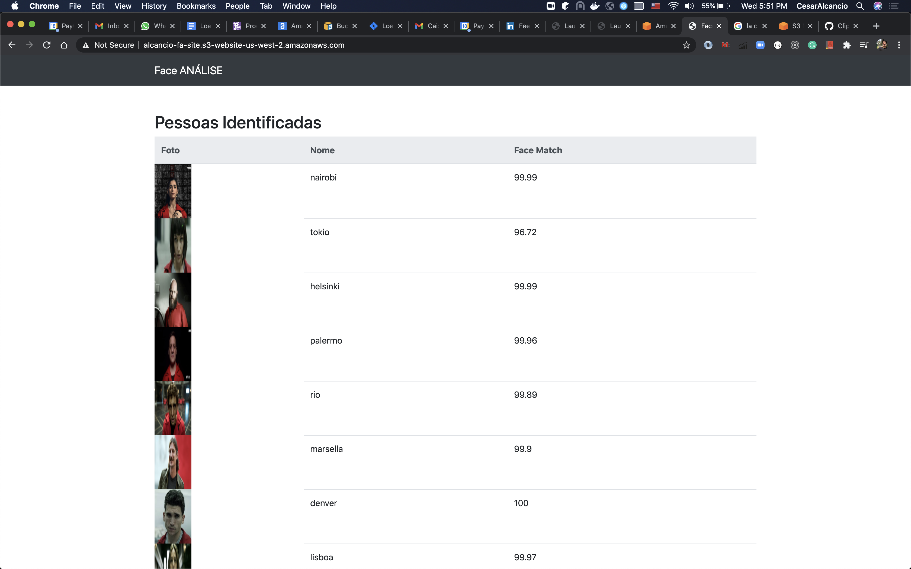

# Lambda Curse

## Function for Face Rekognition

### Setup
* Amazon Account with full access
* Python3 installed in the local machine (to run script)
* Bash
* AWS CLI configured local

### How it works
* First we need to create the buckets and policies
* We need to run the setup python script locally
* Create the lambda and configure it with S3 Bucket listener
* Upload new image
* Check the site if the lambda could recognize the new faces based on the database

### rekognition_setup_images.py
Python script responsible for index images that are in the S3 Bucket "alcancio-fa-images".  
Before run it you need to create an collection called "faces", the script is inside the "upload-images-aws.sh".  
Also the script "upload-images-aws.sh" has the steps to upload the images in the s3 bucket and run some commands in aws rekognition.
It will run once in the local machine.    

### fa-site (folder)
This is a static project that will be deployed in amazon S3 Bucket "alcancio-fa-site".  
The lambda will generate a file called "dados.json" that will be consumed by the front-end.
The dados.json file will be stored in the same S3 Bucket "alcancio-fa-site" by the lambda function.  

### face_analyse.py (Lambda function)
This is the lambda function responsible for listening the S3 Bucket "alcancio-fa-images" for images named "for_analysis.jpeg".  
This script will scan the faces in this image and compare it with the images stored in the "database" executed by the rekognition_setup_images.py.  

### S3 Buckets
There are 2 buckets needed:
* alcancio-fa-site: For static site. You need to configure the policy to allow let it public and allow it for "getObjects".
* alcancio-fa-images: This is the image database, we to let it public and give access for the s3 bucket site to access it.

Both needs BucketPolicy configuration but they don't need CORS configuration (as specified in the course).

**Policies:**  
**alcancio-fa-images**  
`{
    "Version": "2012-10-17",
    "Id": "http referer policy example",
    "Statement": [
        {
            "Sid": "Allow get requests originating from www.example.com and example.com.",
            "Effect": "Allow",
            "Principal": "*",
            "Action": [
                "s3:GetObject",
                "s3:GetObjectVersion"
            ],
            "Resource": "arn:aws:s3:::alcancio-fa-images/*",
            "Condition": {
                "StringLike": {
                    "aws:Referer": "http://alcancio-fa-site.s3-website-us-west-2.amazonaws.com/*"
                }
            }
        }
    ]
}`

**alcancio-fa-site**  
`{
    "Version": "2012-10-17",
    "Statement": [
        {
            "Sid": "PublicReadGetObject",
            "Effect": "Allow",
            "Principal": "*",
            "Action": "s3:GetObject",
            "Resource": "arn:aws:s3:::alcancio-fa-site/*"
        }
    ]
}`